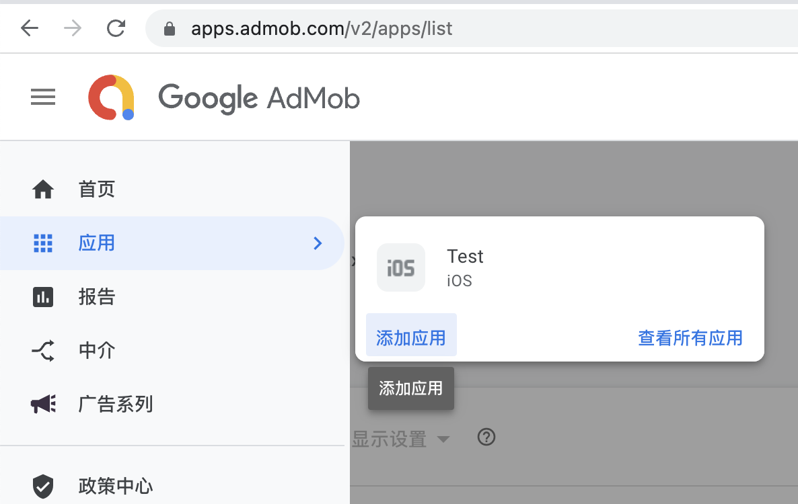
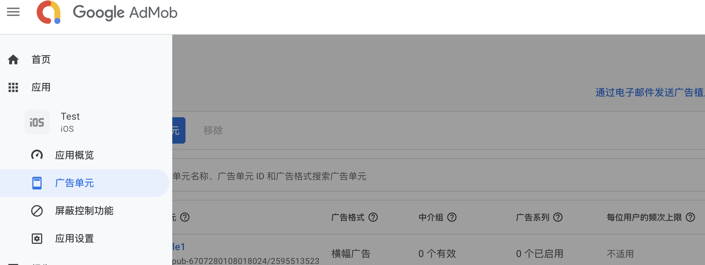
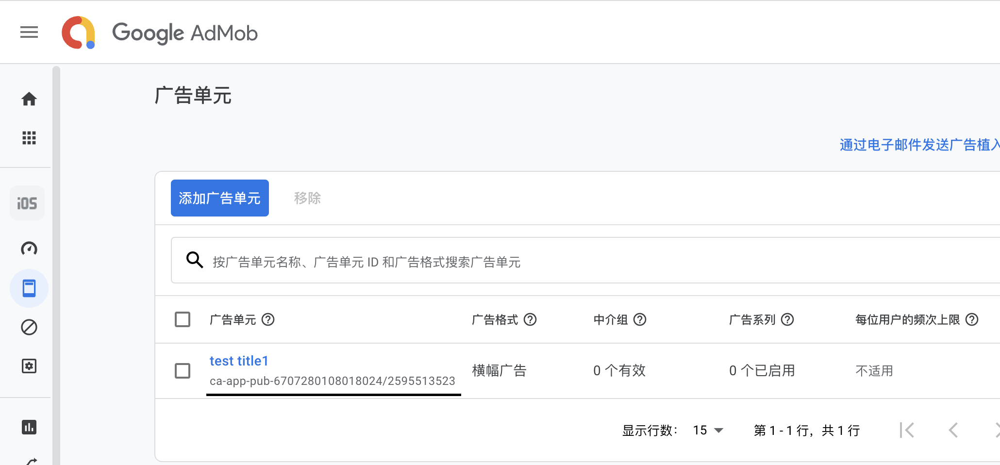
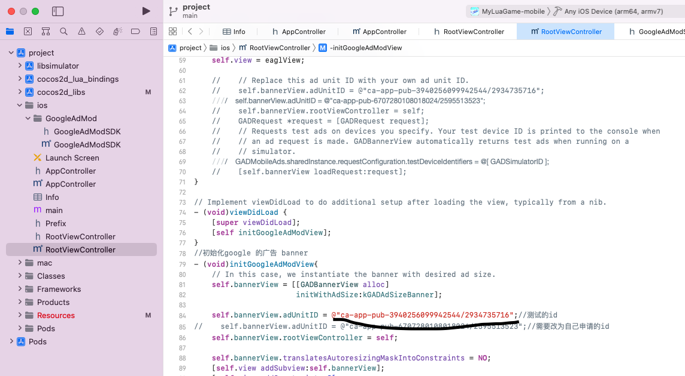
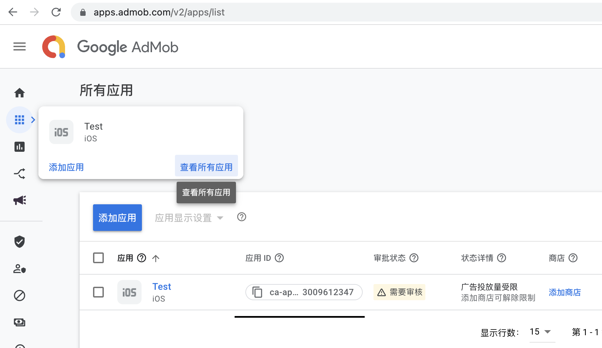
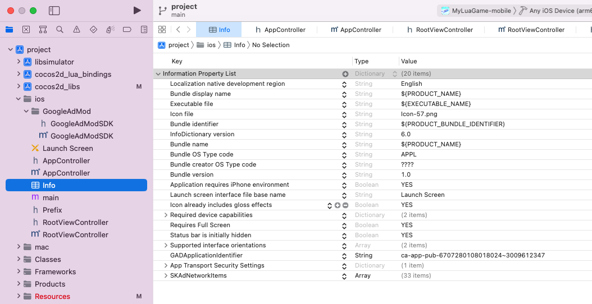

引擎版本： Cocos2dx-lua 3.10

##### 开发需求

- 使用纯lua编写游戏，不要修改及增加coocs2dx引擎c++代码
- 游戏资源脚本无需加密、混淆
- 无需过度封装

##### Lua开发

推荐使用框架自带模拟器开发，验收时再真机运行并导出ipa或者apk。打开终端，输入下面命令运行模拟器。

```sh
$ cd sh
$ ./run.sh
```

使用`cmd + r` 快速重启模拟器，修改`run.sh`可以自定义分辨率等，具体看该文件。

##### Lua调试

推荐使用`VSCode`进行开发， 下载`luaide-lite`可以调试lua

##### iOS真机

1. 使用Xcode打开文件`proj_lua_lite/frameworks/runtime-src/proj.ios_mac/project.xcodeproj`
2. 添加调试账号
3. 设置bundie id
4. 运行即可

##### Android真机

###### run

1. 使用Android Studiod打开目录`proj_lua_lite/frameworks/runtime-src/proj.android-studio`
2. `local.properties` 文件中配置本地SDK目录`sdk.dir=sdkPath`
3. 下载NDK `android-ndk-r14b`
4. `local.properties` 文件中配置本地ndk目录 `ndk.dir=ndkPath`
5. 点击菜单`File/Sync Project with Gradle Files` 同步gradle文件
6. ** 注意因为 `.externalNativeBuild` 文件夹是忽略提交的，所以额外的需要点击一下菜单栏 `Build/refresh lingked C++ projects` **
7. 点击`run`或者`debug`按钮即可运行游戏

###### build

1. 点击菜单`Build/Build Bundle(s)/APK(s)/Build APK(s)`
2. 打包后文件地址在`proj_lua_lite/frameworks/runtime-src/proj.android-studio/app/build/outputs/apk/debug/MyLuaGame-debug.apk`

> **安卓编译需注意 **
> **目前发现在M1芯片的新macbook上使用旧版本的ndk-r14无法正常编译，会导致报错。 **
> 如果是使用M1的新macbook麻烦注释掉工程中 `app/build.gradle` 中的 externalNativeBuild配置 + ndk配置。
> 将 `sourceSets.main` 中 `jniLibs.srcDirs` 行开启，使用已经编译号的so库进行出包即可。
> 若不是M1的macbook，有修改C++代码的需求或调试C++情况，可以启用 `app/build.gradle`中的 externalNativeBuild配置 + ndk配置，注释`jniLibs.srcDirs`行自行编译so。

##### 游戏开发

竖版游戏要求仍以横版的模式来开发，通过旋转根节点来适配，适配代码参考如下

```lua
local rotateNode = cc.Node:create()
rotateNode:addTo(self)
rotateNode:setContentSize(cc.size(display.height, display.width))
rotateNode:setAnchorPoint(cc.p(0.5, 0.5))
rotateNode:setRotation(-90)
rotateNode:move(display.cx, display.cy)
self.rotateNode = rotateNode
display.realWidth = display.height
display.realHeight = display.width
display.realCx = display.cy
display.realCy = display.cx
```

##### 交付规范

- 游戏内容需适配iphone和ipad
- 游戏资源代码存放在单一目录，目录按游戏名称，例如游戏名称为NumberMerge,，则代码放在src/NumberMerge，资源放在res/NumberMerge
- 游戏lua入口文件固定为MainScene.lua

##### 交付资源目录

以提交数字合并为例

```
NumberMerge
    |--res
        |--NumberMerge
    |--src
        |--NumberMerge
            |--MainScene.lua
    |--数字合并.plist
    |--NumberMerge.appiconset
```

##### GoogleADMob的接入

A.获取GoogleAD的广告id和App的Banner的id。 a.在GoogleABMod（ https://apps.admob.com ) 申请账号并登陆到控制台 b.在控制台新建对应的IOS 平台App (如图：)

c.在创建好的应用中创建-广告单元-->横幅广告

d.复制横幅广告的id ( ca-app-pub-6707280108018024/2595513523 )到

RootViewController.mm 文件

e.复制googleAD中创建app 的 应用id (ca-app-pub-6707280108018024~3009612347) 到

Info.plist


    